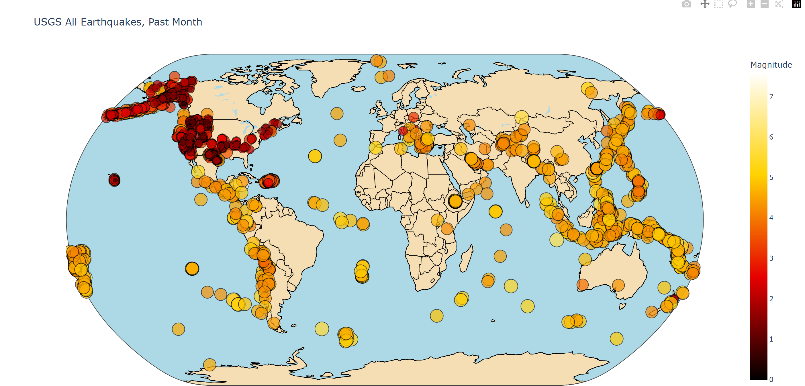

# Earthquakes Plotly Map



An interactive visualization of global earthquake activity using Plotly. This project visualizes earthquake data collected over a period of time, providing a visually appealing and informative way to explore seismic events worldwide.

## Features
- Global Earthquake Data: Visualizes data from USGS earthquake feeds, plotting the magnitude, location, and title of each earthquake.
- Interactive Map: Uses Plotly’s scatter_geo for dynamic map interaction, with features like zooming and panning.
- Customizable Appearance: Customize the appearance of the map with different color schemes, opacity, and layout for better presentation.
- Live Updates: Easily adaptable to display real-time earthquake activity with updated datasets.

## Data Source
The data is sourced from the [USGS Earthquake Feed](https://earthquake.usgs.gov/earthquakes/feed/v1.0/geojson.php) in GeoJSON format, which is processed and visualized in this project.

## Requirements
- Python 3.x
- Pathlib
- Plotly
To install dependencies, use:
```bash
pip install -r requirements.txt
```

## How to Use
1. Clone this repository:
```bash
git clone https://github.com/pablo727/earthquakes_plotly_map.git
```

2. Install the required libraries:
```bash
pip install plotly
pip install pathlib
```

3. Download the latest earthquake data (or use your local dataset):
```python
from pathlib import Path
import requests
import json

# Fetch the data from USGS Earthquake feed
url = "https://earthquake.usgs.gov/earthquakes/feed/v1.0/summary/significant_month.geojson"
response = requests.get(url)
all_eq_data = response.json()

# Save it to a file
path = Path('eq_data/eq_all_month.geojson')
path.write_text(json.dumps(all_eq_data))
```

4. Run the visualization script:
```bash
python eq_month_world_map.py
```

5. The map will be generated and displayed in your browser. You can also save it as an HTML file using:
```python
fig.write_html("earthquakes_map.html")
```

## Customization
You can adjust the appearance of the map by modifying the Plotly scatter_geo parameters, such as:
- Color schemes: color_continuous_scale
- Land and ocean colors
- Marker size and opacity

## Contributing
Feel free to fork this repo and submit pull requests. Contributions are welcome!

## License
This project is licensed under the [MIT License](https://opensource.org/licenses/MIT)


